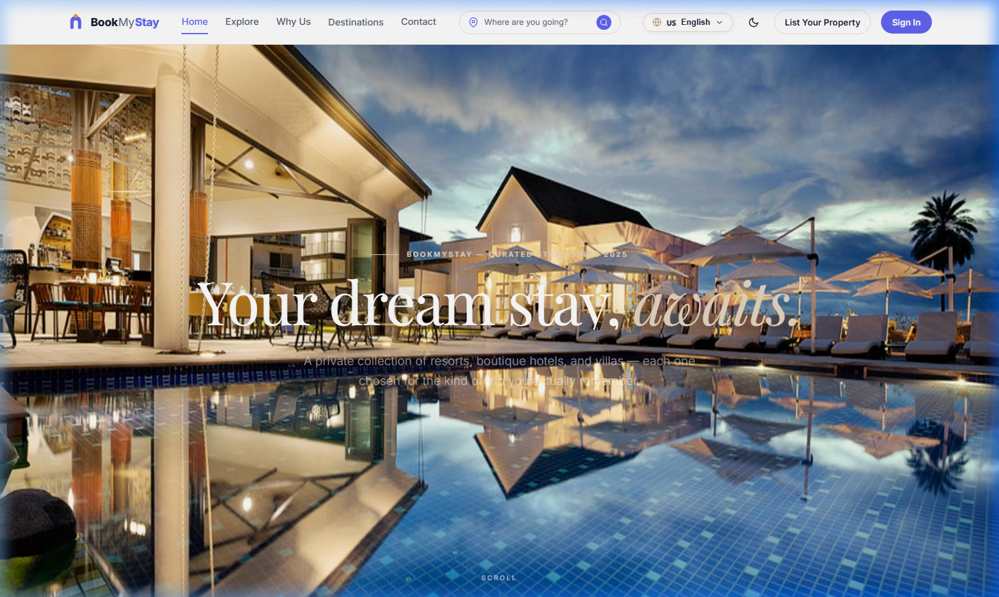
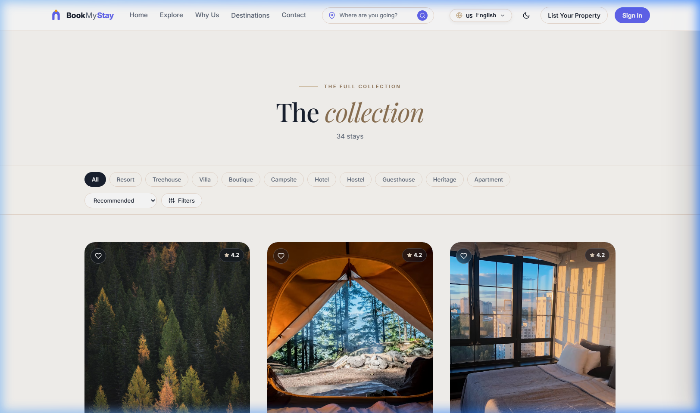
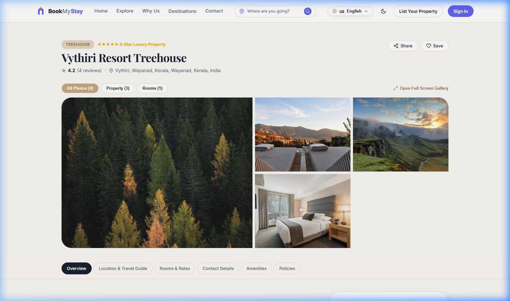
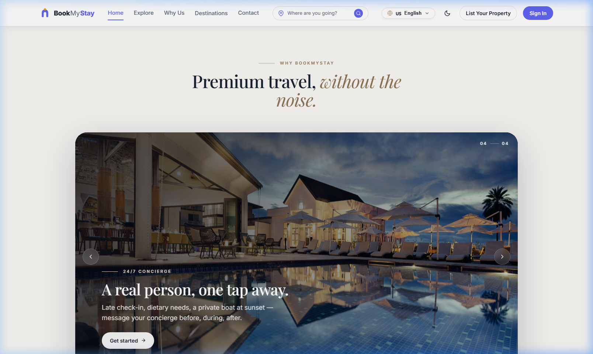
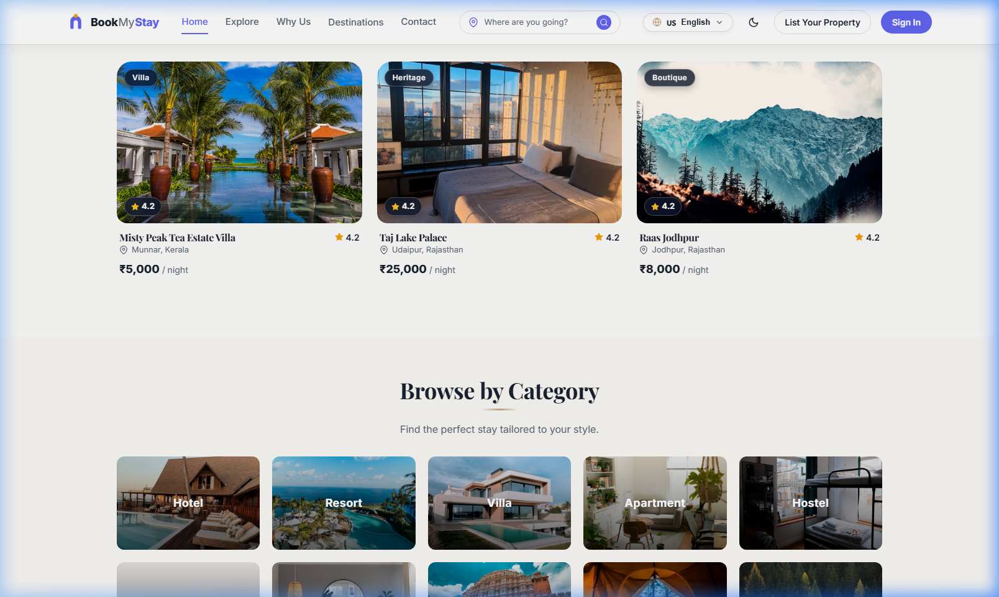
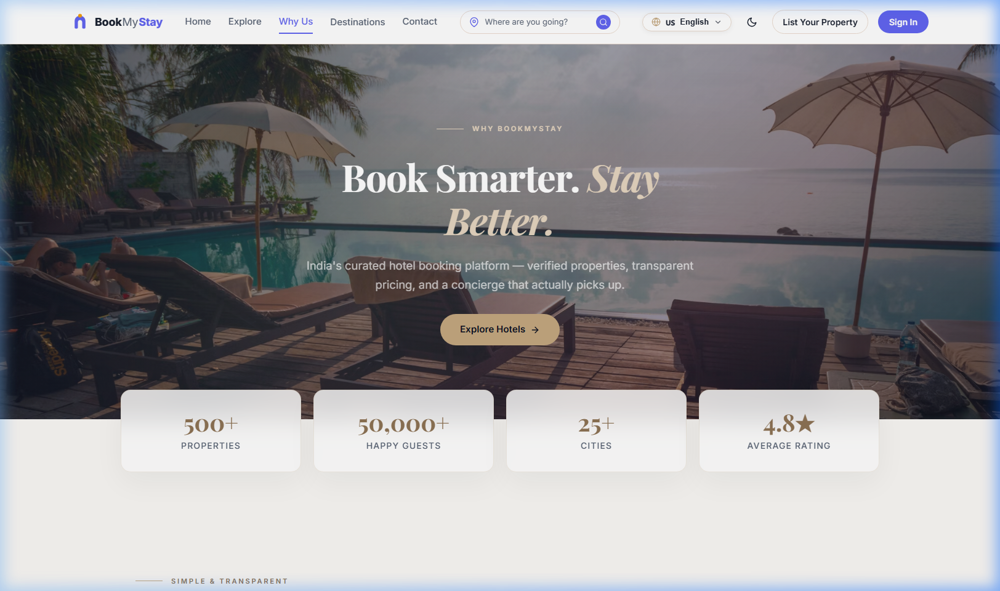
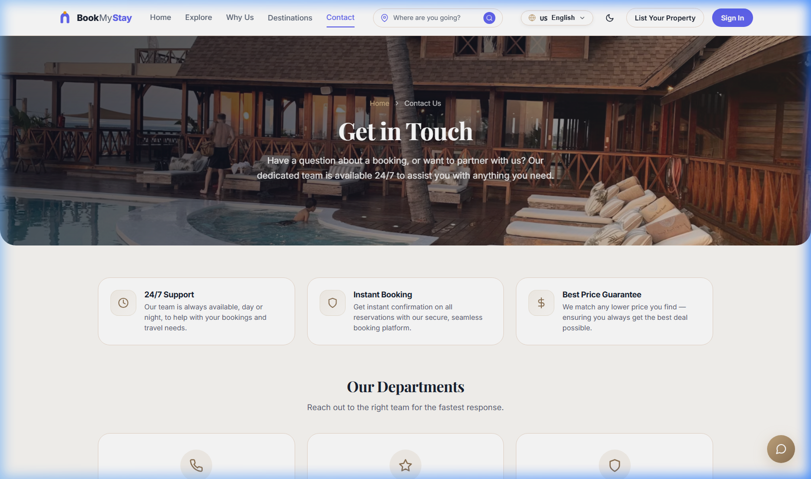
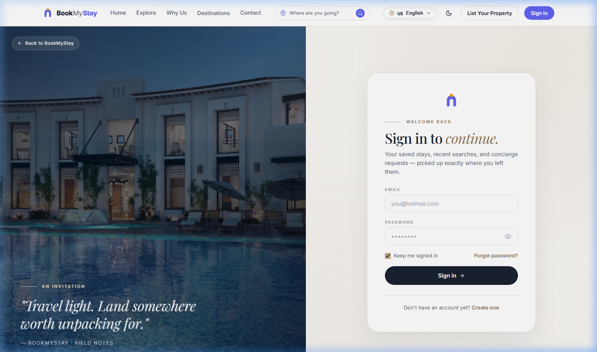

<div align="center">

# 🏨 BookMyStay — Luxury Hotel Reservation & Property Management System

**An enterprise-grade, full-stack hotel booking platform built with React 18, Node.js, Express, MongoDB Atlas, Stripe, and Razorpay.**

[](https://hotel-booking-management-kappa.vercel.app)
[](https://hotel-booking-management-kappa.vercel.app/api/v1/health)
[](https://github.com/Deep-tech-1314/hotel-booking-management)
[](LICENSE)

<br />

<!-- MAIN HERO SCREENSHOT -->
<a href="https://hotel-booking-management-kappa.vercel.app">
  
</a>

<br />

[Explore Features](#-features--capabilities) • [Live App](https://hotel-booking-management-kappa.vercel.app) • [Architecture](#-system-architecture) • [App Preview](#-visual-walkthrough) • [Getting Started](#-local-installation--quickstart)

---

</div>

## 🌟 Executive Summary

**BookMyStay** is a production-ready luxury travel reservation and multi-vendor property management ecosystem. Engineered from the ground up to solve complex travel booking workflows, BookMyStay offers an ultra-fluid, responsive guest interface paired with a sophisticated property owner command center ("Grand Theme") and a platform-wide administrative suite.

Whether travelers are seeking heritage palaces in Rajasthan, misty hillside villas in Munnar, or beachfront cottages in Goa, BookMyStay provides a seamless end-to-end booking journey with real-time room availability, multi-currency pricing, verified guest reviews, and dual payment options (**Stripe** & **Razorpay**).

---

## 🚀 Live Production Links

| Resource | Live Link | Status |
| :--- | :--- | :--- |
| **🌐 Main Web Application** | [https://hotel-booking-management-kappa.vercel.app](https://hotel-booking-management-kappa.vercel.app) | `Online 24/7` |
| **⚡ Backend Health Endpoint** | [https://hotel-booking-management-kappa.vercel.app/api/v1/health](https://hotel-booking-management-kappa.vercel.app/api/v1/health) | `Active` |
| **🏨 Hotels API Endpoint** | [https://hotel-booking-management-kappa.vercel.app/api/v1/hotels](https://hotel-booking-management-kappa.vercel.app/api/v1/hotels) | `Connected (Atlas)` |

---

## 📸 Visual Walkthrough & Screenshots

### 1. 🔍 Instant Search & Multi-Criteria Filtering
> Dynamic filtering by city, star rating, price range slider, category (*Hotel, Resort, Villa, Apartment, Hostel*), and amenities.
<div align="center">
  
</div>

<br />

### 2. 🛏️ Detailed Hotel Showcase & Room Selection
> High-resolution image galleries, detailed room type breakdowns, dynamic date pickers, price calculation, and real-time review scores.
<div align="center">
  
</div>

<br />

### 3. ✨ Curated Featured Luxury Properties
> Spotlight presentation of top-rated stays with instant wishlist toggles and pricing highlights.
<div align="center">
  
</div>

<br />

### 4. 🏖️ Trending Destinations & Category Navigation
> Explore properties categorized across popular vacation spots (Jaipur, Rishikesh, Ladakh, Goa, Kerala).
<div align="center">
  
</div>

<br />

### 5. 💎 "Why Choose BookMyStay" Value Proposition
> Transparent pricing, 24/7 verified booking guarantee, flexible cancellations, and member perks.
<div align="center">
  
</div>

<br />

### 6. 📞 24/7 Concierge Support & Direct Inquiries
> Interactive support portal allowing guests and owners to send direct inquiries and concierge requests.
<div align="center">
  
</div>

<br />

### 7. 🔐 Secure Guest Authentication & Portals
> JWT-powered user registration, password reset flows, secure cookie sessions, and role-based portal routing.
<div align="center">
  
</div>

---

## ⚡ Features & Capabilities

### 👤 Guest Experience
* **Advanced Multi-Dimensional Filtering**: Search by location, stay category, amenities (WiFi, Pool, Spa, Ocean View), price bounds, and ratings.
* **Smart Booking Engine**: Live availability checks preventing overbooking, interactive check-in/out date range selector, and guest configuration.
* **Coupon & Promo Engine**: Real-time coupon validation with immediate discount calculations.
* **Dual Secure Payments**:
  * **Stripe**: International card payments (Visa, MasterCard, Amex) with PCI-compliant tokenization.
  * **Razorpay**: Domestic Indian payment options including UPI, Google Pay, PhonePe, and NetBanking.
* **Personalized Guest Space**: Manage active & past reservations, generate printable invoices, manage wishlist properties, and write verified reviews.
* **Internationalization & Themes**: Language picker and seamless Dark / Light luxury theme switcher.

### 🏨 Property Owner Workspace ("Grand Theme")
* **Luxury Host Command Center**: Bespoke dark/gold "Grand Theme" UI specifically customized for boutique and luxury property managers.
* **Inventory Control**: Add new hotel listings with rich descriptions, address geocoding, room type variants, and amenity matrices.
* **Media Uploads via Cloudinary**: Direct multi-image drag-and-drop uploads with automatic thumbnailing and CDN delivery.
* **Financial & Occupancy Analytics**: Real-time revenue summaries, payout trackers, and monthly reservation logs.
* **Guest Message Center**: In-app communication channel to manage guest queries prior to check-in.

### 🛡️ Platform Admin Dashboard
* **System Metrics & Charts**: Visual data summaries powered by **Recharts** displaying user growth, platform GMV, average stay duration, and booking trends.
* **User & Owner Moderation**: Role management, hotel approval workflows, and user status toggling.
* **Promotions Manager**: Create and distribute discount coupons with minimum spends, usage caps, and expirations.
* **Live SSE Notification Stream**: Server-Sent Events delivering instant booking notifications across the management tier.

---

## 🛠️ Technology Stack & Architecture

```
┌─────────────────────────────────────────────────────────────┐
│                    REACT 18 CLIENT (VITE)                   │
│  Redux Toolkit • React Router v6 • Glassmorphism CSS System │
└──────────────────────────────┬──────────────────────────────┘
                               │ HTTP / SSE / REST APIs
┌──────────────────────────────▼──────────────────────────────┐
│                  EXPRESS.JS SERVERLESS API                  │
│       JWT Auth • Rate Limiting • Helmet • Multer • CORS     │
└───────┬──────────────────────┬──────────────────────┬───────┘
        │                      │                      │
┌───────▼────────┐     ┌───────▼────────┐     ┌───────▼───────┐
│ MONGODB ATLAS  │     │ CLOUDINARY CDN │     │ STRIPE & RZP  │
│  Mongoose ODM  │     │ Image Storage  │     │ Payment Gate  │
└────────────────┘     └────────────────┘     └───────────────┘
```

| Layer | Technologies |
| :--- | :--- |
| **Frontend** | React 18, Vite 5, Redux Toolkit, React Router 6, Vanilla CSS3 (Custom Tokens & Grand Theme), React Icons, React Hot Toast, Recharts |
| **Backend API** | Node.js 18+, Express.js 4, Serverless Functions (`@vercel/node`) |
| **Database** | MongoDB Atlas, Mongoose 8 ORM |
| **Storage & Media** | Cloudinary API, Multer (Memory Storage for Serverless) |
| **Payments** | Stripe API (`@stripe/stripe-js`), Razorpay SDK |
| **Security** | JWT (HttpOnly Cookies + Refresh Tokens), Bcrypt.js, Helmet, CORS, Express-Rate-Limit |
| **Deployment** | Vercel Edge Global Network |

---

## 📂 Project Structure

```
hotel-booking-management/
├── client/                     # Frontend React 18 Application
│   ├── public/                 # Static vector assets & web icons
│   ├── src/
│   │   ├── components/         # Reusable UI widgets, modals, cards, layouts
│   │   ├── context/            # Global context (Language, Theme)
│   │   ├── hooks/              # Custom React hooks (scroll animations, etc.)
│   │   ├── pages/              # 25+ Application Views (Public, Guest, Owner, Admin)
│   │   ├── redux/              # Redux slices (Auth, Hotels, Bookings, UI, Admin)
│   │   ├── styles/             # Grand theme, luxury checkout, and animations CSS
│   │   └── utils/              # Axios instance with interceptors, formatters
│   ├── package.json
│   └── vite.config.js
│
├── server/                     # Backend Express REST API
│   ├── config/                 # MongoDB Atlas connection & Cloudinary setup
│   ├── controllers/            # Controller logic (Auth, Hotels, Rooms, Payments)
│   ├── middleware/             # Role authorization, rate limiters, upload handlers
│   ├── models/                 # Mongoose schemas (User, Hotel, Room, Booking, Review)
│   ├── routes/                 # Express API endpoints (/api/v1/*)
│   ├── services/               # Notification & real-time SSE stream services
│   ├── utils/                  # 30+ hotel database seeder, email templates
│   └── server.js               # Express application entrypoint
│
├── api/                        # Vercel Serverless Function Bridge
│   └── index.js
├── docs/                       # Project Documentation & Screenshots
│   └── screenshots/
├── vercel.json                 # Vercel Serverless routing & SPA rewrites
├── package.json                # Project root workspace scripts
└── README.md                   # Complete documentation
```

---

## ⚡ Local Installation & Quickstart

### Prerequisites
- **Node.js**: v18.0.0 or higher
- **npm** or **yarn**
- **MongoDB Atlas** account (or local MongoDB daemon)

### 1. Clone the Repository
```bash
git clone https://github.com/Deep-tech-1314/hotel-booking-management.git
cd hotel-booking-management
```

### 2. Install All Dependencies
One command installs dependencies for root, client, and server workspaces:
```bash
npm run install-all
```

### 3. Configure Environment Variables
Create a `.env` file in the `server` folder (or copy from `server/.env.example`):

```env
PORT=5000
NODE_ENV=development
MONGO_URI=mongodb+srv://<username>:<password>@cluster0.mongodb.net/bookmystay
JWT_SECRET=your_jwt_secret_key_here
JWT_EXPIRE=7d
REFRESH_TOKEN_SECRET=your_refresh_token_secret_here
REFRESH_TOKEN_EXPIRE=7d

# Cloudinary (Optional - memory storage fallback active)
CLOUDINARY_CLOUD_NAME=your_cloud_name
CLOUDINARY_API_KEY=your_api_key
CLOUDINARY_API_SECRET=your_api_secret

# Payment Gateways (Optional)
STRIPE_SECRET_KEY=sk_test_your_stripe_key
RAZORPAY_KEY_ID=rzp_test_your_razorpay_key
RAZORPAY_KEY_SECRET=your_razorpay_secret
```

### 4. Seed Database (Optional)
Populate your MongoDB database with 30+ curated Indian luxury hotels, suites, and demo reviews:
```bash
cd server
npm run seed
```

### 5. Launch Development Server
Start the frontend client and backend API concurrently:
```bash
npm run dev
```
- 🌐 **Client**: `http://localhost:5173`
- ⚡ **API Server**: `http://localhost:5000/api/v1`

---

## 🔒 Security Best Practices

* **No Secret Leakage**: All `.env` configurations are git-ignored and securely stored in Vercel's encrypted environment vault.
* **Sanitized Client Bundles**: Vite strictly isolates backend logic. No secret keys or database connection strings exist in browser bundles.
* **Authentication Security**: Access tokens and refresh tokens are signed with cryptographic algorithms and verified per-request.
* **Payload Defense**: Built-in rate limiting and Helmet headers protect against DDoS and common web vulnerabilities.

---

## 🤝 Contributing

Contributions, issues, and feature suggestions are welcome!

1. Fork the Project
2. Create your Feature Branch (`git checkout -b feature/NewFeature`)
3. Commit your Changes (`git commit -m 'feat: Add NewFeature'`)
4. Push to the Branch (`git push origin feature/NewFeature`)
5. Open a Pull Request

---

## 📄 License

This project is licensed under the **MIT License** — see the [LICENSE](LICENSE) file for details.

---

<div align="center">
  <p>Built with ❤️ by <a href="https://github.com/Deep-tech-1314"><b>Deep-tech-1314</b></a></p>
  <p>⭐ Star this repository if you found it helpful!</p>
</div>
